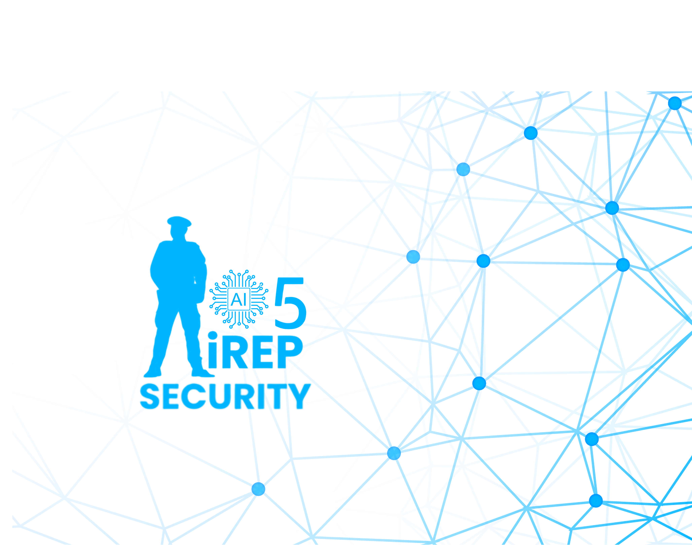

 

# iRep

### Security fieldwork, elevated.

A calm, mobile-first operations kit built for the realities of the shift —  
not another form-heavy desktop tool.

 

  

&nbsp;

 

---

 

### The Idea

> Guards don’t need another form dump.  
> They need a toolkit that respects the shift.

**iRep** is a focused operations product for security teams.  
It brings the daily essentials of field work into one clean, intentional mobile experience — designed for the phone in a guard’s pocket.

 

### What It Delivers

<table>
  <tr>
    <td width="50%" valign="top">

**Staff Identity**  
Secure login and profiles

</td>
    <td width="50%" valign="top">

**Shift Overview**  
Clear operations dashboard

</td>
  </tr>
  <tr>
    <td width="50%" valign="top">

**Attendance**  
Reliable clock-in with NFC support

</td>
    <td width="50%" valign="top">

**Incident Reporting**  
Structured reports and cases

</td>
  </tr>
  <tr>
    <td width="50%" valign="top">

**E-Occurrence**  
Digital occurrence trail

</td>
    <td width="50%" valign="top">

**Leave Management**  
Apply and track time off

</td>
  </tr>
  <tr>
    <td width="50%" valign="top">

**SOPs**  
Company and client site procedures

</td>
    <td width="50%" valign="top">

**Field Tools**  
Key pass, jobs, payslips, AAR & more

</td>
  </tr>
</table>

 

### Interface

  
  &nbsp;&nbsp;
  

  Designed for real field conditions — clean, focused, and fast

 

---

 

### Work With The Developer

**Umar Anayat** designs and ships Flutter products that feel intentional.  
Calm motion. Sharp UI. Features people actually use.

Looking to customize, white-label, or adapt this project to your brand?

 

&nbsp;

 

iumaranayat@gmail.com &nbsp;·&nbsp; +92 308 7863007

 
